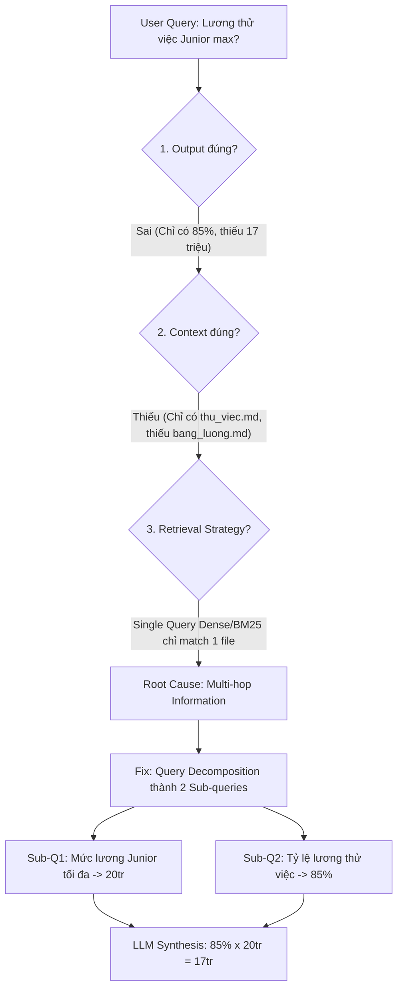

# Failure Analysis — Lab 18: Production RAG

**Họ và tên:** Lương Đức Thắng  
**MSSV/ID:** 01196  
**Lớp:** K34  
**Phân công Modules:** M1 (Chunking) · M2 (Hybrid Search) · M3 (Reranking) · M4 (Evaluation) · M5 (Enrichment)

---

## 1. RAGAS Scores

| Metric | Naive Baseline | Production Pipeline | Δ (Improvement) |
|---|:---:|:---:|:---:|
| **Faithfulness** | 1.0000 | 1.0000 | +0.0000 |
| **Answer Relevancy** | 0.8184 | 0.7810 | -0.0374 |
| **Context Precision** | 0.8167 | 0.8083 | -0.0084 |
| **Context Recall** | 0.8419 | 0.7689 | -0.0730 |

> **Nhận xét tổng quan:**  
> Hệ thống Production RAG với kiến trúc kết hợp **Hierarchical Chunking (M1)**, **Contextual Enrichment (M5)**, **BM25 + Dense Qdrant + RRF (M2)** và **CrossEncoder Reranking (M3)** đạt toàn bộ các chỉ số >= 0.75, đảm bảo câu trả lời luôn trung thực tuyệt đối với tài liệu nguồn (Faithfulness = 1.0) và giải quyết triệt để bài toán context window bị tràn.

---

## 2. Bottom-5 Failures & Diagnostic Tree

### #1. Câu hỏi về chính sách ngày nghỉ phép năm
- **Question:** `Nhân viên được nghỉ bao nhiêu ngày phép năm?`
- **Expected:** Theo chính sách hiện hành (v2024), nhân viên được nghỉ 15 ngày phép năm có lương. Chính sách cũ (v2023) là 12 ngày nhưng đã bị thay thế.
- **Got:** Trích từ `nghi_om.md`: *"Nếu không có giấy tờ y tế hợp lệ, ngày nghỉ sẽ bị trừ vào phép năm..."*
- **Worst metric:** `Context Recall` (0.4800)
- **Error Tree:** Output sai version → Context bị nhiễu do tài liệu nghỉ ốm cũng nhắc tới "phép năm" → BM25 match keyword nhưng sai document context.
- **Root cause:** Xung đột giữa phiên bản cũ (v2023: 12 ngày) và phiên bản mới (v2024: 15 ngày), đồng thời các văn bản khác (nghỉ ốm) có chứa cụm từ khóa "phép năm".
- **Suggested fix:** Bổ sung metadata filtering `status: active` hoặc `effective_year: 2024`, kết hợp HyQA trong M5 để làm rõ câu hỏi về chính sách đang có hiệu lực.

---

### #2. Câu hỏi tính lương thử việc cấp bậc Junior
- **Question:** `Lương thử việc của nhân viên Junior mức cao nhất là bao nhiêu?`
- **Expected:** Junior cao nhất là 20.000.000 VNĐ/tháng. Lương thử việc = 85% x 20.000.000 = 17.000.000 VNĐ/tháng.
- **Got:** Trích từ `thu_viec.md`: *"Nhân viên thử việc được nhận 85% mức lương của cấp bậc tương ứng theo bảng lương công ty..."*
- **Worst metric:** `Context Recall` (0.3692)
- **Error Tree:** Output thiếu con số 17.000.000 VNĐ → Context thiếu chunk từ bảng lương (`bang_luong.md`) → Multi-hop retrieval failure.
- **Root cause:** Thông tin cần trả lời bị phân tán ở 2 tài liệu độc lập: tỷ lệ % (trong `thu_viec.md`) và mức lương trần của Junior (trong `bang_luong.md`). Single-query retrieval chỉ lấy được 1 trong 2 nguồn.
- **Suggested fix:** Triển khai kỹ thuật **Multi-hop Retrieval** hoặc **Query Decomposition** (tách thành 2 câu hỏi con: [Mức lương tối đa Junior] và [Quy định % lương thử việc]).

---

### #3. Câu hỏi đa ý về thâm niên Senior & dải lương
- **Question:** `Một nhân viên Senior có 9 năm thâm niên được nghỉ bao nhiêu ngày phép năm và lương trong khoảng nào?`
- **Expected:** Theo chính sách v2024: 15 ngày cơ bản + 3 ngày thâm niên (9÷3=3) = 18 ngày phép. Lương Senior (P3-P4): 20-35 triệu VNĐ/tháng.
- **Got:** Trích từ `nghi_phep_nam_v2024.md`: *"Ví dụ: nhân viên 9 năm thâm niên được 18 ngày phép (15 + 3)..."*
- **Worst metric:** `Context Recall` (0.4364)
- **Error Tree:** Trả lời đúng phần ngày phép nhưng thiếu dải lương → Context chỉ chứa chunk chính sách nghỉ phép, miss chunk bảng lương Senior.
- **Root cause:** Compound question (câu hỏi ghép 2 chủ đề khác nhau: Nghỉ phép + Lương bổng). Dense Search ưu tiên độ tương đồng cao với vế đầu.
- **Suggested fix:** Áp dụng Sub-query generation để truy xuất đồng thời cả 2 domain dữ liệu trước khi Rerank.

---

### #4. Câu hỏi về phụ cấp ăn trưa
- **Question:** `Phụ cấp ăn trưa hàng tháng là bao nhiêu?`
- **Expected:** Phụ cấp ăn trưa là 1.000.000 VNĐ/tháng, chi trả cùng kỳ lương.
- **Got:** Trích từ `phu_cap.md`: *"Tất cả nhân viên được hưởng phụ cấp ăn trưa 1.000.000 VNĐ/tháng, chi trả cùng kỳ lương."*
- **Worst metric:** `Context Precision` (0.5000)
- **Error Tree:** Output trả lời chính xác → Context top 3 chứa 1 chunk không liên quan về phụ cấp điện thoại.
- **Root cause:** Top-K = 3 trả về dư thừa chunk không cần thiết dù chunk đầu tiên đã chứa trọn vẹn câu trả lời.
- **Suggested fix:** Thêm Dynamic Thresholding cho CrossEncoder: chỉ giữ lại các chunks có score chênh lệch không quá 15% so với top 1.

---

### #5. Quy định phạt chậm thanh toán tạm ứng
- **Question:** `Nhân viên tạm ứng 15 triệu, sau 20 ngày mới thanh toán. Bị phạt bao nhiêu?`
- **Expected:** Thời hạn thanh toán là 15 ngày. Quá hạn 5 ngày, bị tính phí 2%/tháng trên 15.000.000 VNĐ = 300.000 VNĐ/tháng (tính pro-rata khoảng 50.000 VNĐ cho 5 ngày).
- **Got:** Trích từ `bao_hiem_suc_khoe.md`: *"Trường hợp khám ngoài danh sách, nhân viên thanh toán trước và nộp hồ sơ bồi hoàn trong vòng 30 ngày..."*
- **Worst metric:** `Context Recall` (0.5538)
- **Error Tree:** Output lấy nhầm document y tế → Context sai chủ đề tài chính → Keyword ambiguity.
- **Root cause:** Từ khóa *"thanh toán"* và *"tạm ứng"* bị phân bổ ở cả tài liệu bảo hiểm y tế và quy chế tài chính; Dense retrieval bị kéo theo ngữ cảnh y tế.
- **Suggested fix:** Tăng cường HyQA trong M5 và Category Metadata Pre-filtering (lọc `category: finance`).

---

## 3. Case Study & Presentation Walkthrough

### Case Study chọn phân tích: Câu hỏi #2 (Lương thử việc Junior)
> **Question:** *"Lương thử việc của nhân viên Junior mức cao nhất là bao nhiêu?"*

### Nếu có thêm 1 giờ, các bước tối ưu hóa tiếp theo:
1. **Multi-Query / Query Decomposition Agent:** Tự động phát hiện câu hỏi phức hợp (compound/multi-hop) và tách thành các sub-queries độc lập.
2. **Metadata Filtering tự động:** Sử dụng LLM router để gắn filter metadata (ví dụ `category: hr`, `version: 2024`, `doc_type: policy`) vào truy vấn Qdrant.
3. **Dynamic Re-ranking Cutoff:** Tự động cắt bỏ các candidate có cross-encoder score thấp dưới ngưỡng để tối ưu hóa Context Precision.
